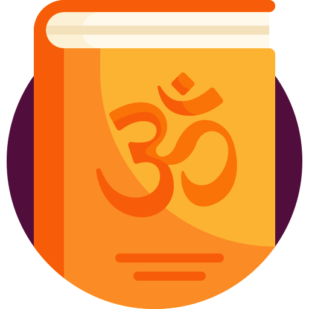

# Ancient Knowledge

 

## About Us

|     |     |
| --- | --- |
||**[AncientKnowledge.in](https://www.ancientknowledge.in)** is a free digital library of ancient scriptures, texts, and books.   *“Our mission is to allow everyone to learn about Vedic Culture and the Sanatana Dharma.”*|

---

## Content

- ✅ श्रीमद्भगवद्गीता - यथारूप (हिंदी)
- ✅ Shrimad Bhagavad Gita - As It Is (English)
- ✅ श्रीरामचरितमानस (हिंदी)
- ✅ Shri Ramcharitmanas (English)

---

## Social media

- [Instagram - praacheengyaan](https://www.instagram.com/praacheengyaan)

- [Facebook - praacheengyaan](https://www.facebook.com/praacheengyaan)

- [Twitter - praacheengyaan](https://www.twitter.com/praacheengyaan)

---

## Contact

We are looking forward to extend our team!

Contact us at [ancientknowledgeinbox@gmail.com](ancientknowledgeinbox@gmail.com) to know more.
